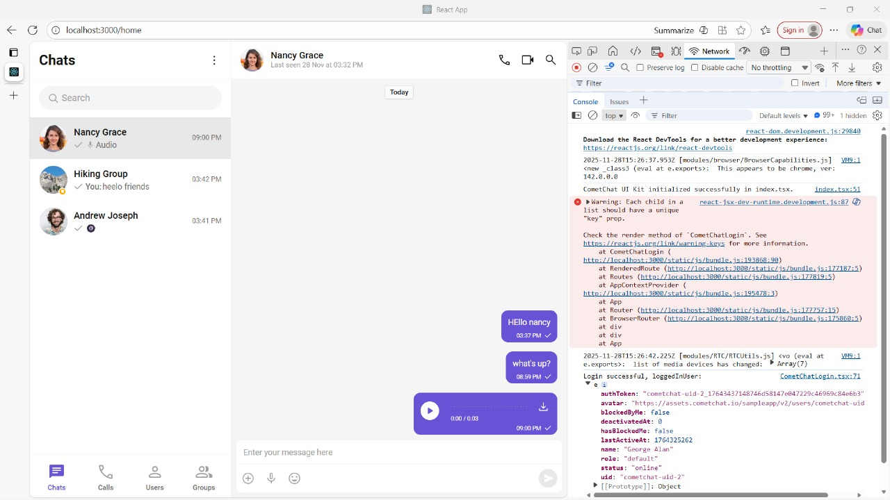

# 📘 CometChat React UI Kit – Evaluation & Bug Report  
_By **Sahilee Gaurkar**_

---

## 🚀 Overview
This repository contains my full evaluation of the **CometChat React UI Kit (Sample App)** as part of the CometChat Internship Assignment.

The evaluation covers the four required areas:

1. **Dashboard**
2. 

3. **How to run**
4. 

5. 
6. **Console errors**
7. 
8. 


9. **Actual UI Kit Implementation**
10. 


For each area, I have documented:

- Expected vs Actual behavior  
- Friction points  
- Bugs or errors  
- Missing or unclear steps  
- Outdated or incorrect documentation  
- Suggestions for improvement  

A full **PDF report** is also included below.
https://sdmntprkoreacentral.oaiusercontent.com/files/00000000-3cbc-7206-b703-77f5b7152059/raw?se=2025-11-28T16%3A01%3A43Z&sp=r&sv=2024-08-04&sr=b&scid=d372407a-ad4d-4801-89e9-835052371ce5&skoid=1e4bb9ed-6bb5-424a-a3aa-79f21566e722&sktid=a48cca56-e6da-484e-a814-9c849652bcb3&skt=2025-11-27T22%3A36%3A52Z&ske=2025-11-28T22%3A36%3A52Z&sks=b&skv=2024-08-04&sig=FMjioObYzvp8Jml1pbKn9b4xJg66sQyJbA0WIY9oYCM%3D

# 🖼️ Screenshots

> Upload your screenshots to the `/assets` folder and replace the filenames below.

### 📌 Dashboard  


### 📌 Sample App GitHub Repository  


### 📌 Running the React Sample App (localhost:3000)  


### 📌 Console Errors & Issues  


---

# 🎥 Demo Video

> Upload your video to `/assets/video.mp4` or drag-and-drop into GitHub.

🎬 **Add Demo Video Here:**  
`./assets/video.mp4`

*(This will be a screen-recording of the working React Sample App showing login, messaging, groups, UI behavior, etc.)*

---

# 📄 PDF Report

> Upload your generated PDF to `/assets/report.pdf` or rename accordingly.

📘 **Full Report (PDF):**  
[Click to open](./assets/CometChat_React_UI_Kit_Full_Report.pdf)

This PDF includes:

- Detailed analysis  
- All four evaluation areas  
- Expected vs Actual  
- Full list of issues  
- Screenshots  
- Recommendations  

---

# ⚙️ Setup Instructions for React Sample App

### 📥 Clone the Repo
```bash
git clone https://github.com/cometchat/cometchat-sample-app-react
cd cometchat-sample-app-react
📦 Install Dependencies
bash
Copy code
npm install
📝 Create .env
Replace your App ID, Region, and Auth Key:

env
Copy code
REACT_APP_COMETCHAT_APP_ID=1672382cb3e1a58bb
REACT_APP_COMETCHAT_REGION=in
REACT_APP_COMETCHAT_AUTH_KEY=0a15ef489aa53689eb610780fb4e7f3ba623dc9b
▶️ Start the App
bash
Copy code
npm start
🔐 Login Using UID
A sample user created in the dashboard:

makefile
Copy code
UID: george
Name: George Alan
📝 Summary of Findings (Short Version)
🔷 Dashboard
UI Kit Builder missing

Sample Apps difficult to find

No onboarding or starting guide

Documentation links poorly placed

🔶 UI Kit Builder / Sample App Flow
UI Kit repo does not run (missing start script)

Sample App found inside GitHub, not dashboard

Environment variables instructions missing

UID creation not explained

📚 Documentation Issues
Outdated references to UI Kit Builder

No .env template

No region explanation

Missing steps for UID creation

No troubleshooting for 401/404 errors

💻 Implementation Issues (React Sample App)
401 unauthorized

404 user not found / auth problems

402 payment required error

Missing React key props

Accessibility issues

Deprecated Web Audio API

CSS compatibility warnings

Security header warnings

UID with spaces causes API failure

Poor error messages

💡 Suggestions for Improvement
Add UID validation in login form

Add "Getting Started" wizard in dashboard

Provide unified UI Kit + Sample App download

Improve documentation with updated screenshots

Add proper .env templates

Fix React key warnings

Improve browser compatibility CSS

Add better API error messages

👤 Author
Sahilee Gaurkar
React & Full-Stack Developer
CometChat Internship Assessment – 2025
